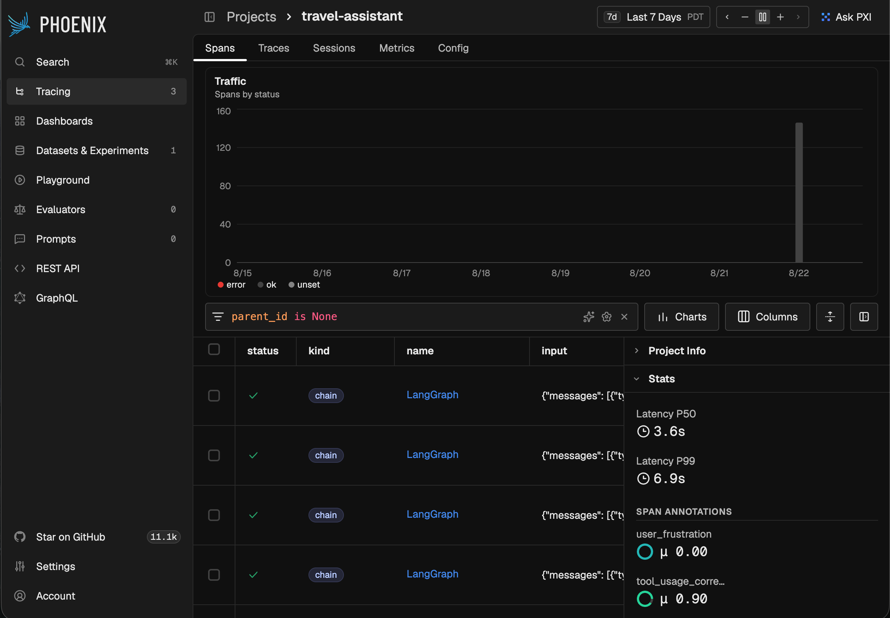

# Travel Assistant — LangGraph Agent with OpenTelemetry Observability

[](https://github.com/morillo/langgraph-travel-assistant/actions/workflows/tests.yml)
[](LICENSE)
[](pyproject.toml)

A travel assistant AI agent built with LangGraph and GPT-4o, fully instrumented
with OpenTelemetry and observable through the open-source
[Phoenix](https://github.com/Arize-ai/phoenix) platform.



*Every agent invocation is traced end-to-end. LLM-as-a-judge scores
(`user_frustration`, `tool_usage_correctness`) are attached to each trace as
span annotations, with latency percentiles tracked per project.*

## Features

- **LangGraph agent** with ReAct-style tool-calling loop
- **DuckDuckGo web search** for travel research (attractions, hotels, visas, etc.)
- **Weather tool** — real-time conditions for any city via Open-Meteo (no API key needed)
- **OpenTelemetry observability** — traces, span annotations, LLM-as-a-judge evaluations
- **FastAPI** server with `/chat` and `/health` endpoints
- **Docker Compose** for one-command startup

---

## Project Structure

```
langgraph-travel-assistant/
├── app/
│   ├── agent.py          # LangGraph agent graph
│   ├── api.py            # FastAPI server with OTel instrumentation
│   └── tools/
│       ├── search.py     # DuckDuckGo web search tool
│       └── weather.py    # Open-Meteo weather tool
├── tests/
│   ├── test_agent.py     # Agent routing + construction tests
│   └── test_tools.py     # Tool unit tests
├── scripts/
│   └── run_queries.py    # Generates 10 evaluation traces
├── evals/
│   ├── eval_pipeline.py  # One-command pipeline: queries → judge → dataset → experiment
│   ├── evaluate.py       # LLM-as-a-judge pipeline + span annotations
│   └── run_experiment.py # Structured experiment (run_experiment())
├── docs/
│   └── architecture.md   # Production architecture design
├── Dockerfile
├── docker-compose.yml
├── pyproject.toml
└── .env.example
```

---

## Prerequisites

- [Docker Desktop](https://www.docker.com/products/docker-desktop/) — for the Docker Compose path
- **or** Python 3.11–3.12 + [Poetry](https://python-poetry.org/docs/#installation) — for the local dev path
- An [OpenAI API key](https://platform.openai.com/api-keys)

---

## Option A — Docker Compose (recommended)

This starts both the travel assistant API and the Phoenix trace backend together.

```bash
# 1. Clone the repo
git clone https://github.com/morillo/langgraph-travel-assistant.git
cd langgraph-travel-assistant

# 2. Create your .env file
cp .env.example .env
# Edit .env and set: OPENAI_API_KEY=sk-...

# 3. Build and start both services
docker compose up --build
```

| Service | URL |
|---|---|
| Travel Assistant API | http://localhost:8000 |
| API docs (Swagger) | http://localhost:8000/docs |
| Phoenix UI | http://localhost:6006 |

**Test it:**

```bash
curl -X POST http://localhost:8000/chat \
  -H "Content-Type: application/json" \
  -d '{"message": "What are the top attractions in Rome?"}'
```

**Stop:**

```bash
docker compose down
```

---

## Option B — Local Development (Poetry)

### 1. Install dependencies

```bash
poetry install
```

### 2. Configure environment

```bash
cp .env.example .env
# Edit .env and set: OPENAI_API_KEY=sk-...
```

### 3. Start Phoenix

```bash
docker run -p 6006:6006 arizephoenix/phoenix:latest
```

### 4. Start the API server

```bash
poetry run uvicorn app.api:app --reload --port 8000
```

### 5. Test it

```bash
curl -X POST http://localhost:8000/chat \
  -H "Content-Type: application/json" \
  -d '{"message": "What is the weather in Tokyo?"}'
```

---

## Run Tests

```bash
poetry run pytest tests/ -v
```

---

## Evaluation Pipeline

After the API server is running and Phoenix has traces:

**One command (recommended):**

```bash
poetry install --with evals
poetry run python evals/eval_pipeline.py
```

This runs the full loop — sends the 10 evaluation queries to the live agent,
scores every response with an LLM-as-a-judge (GPT-4o-mini), uploads the scores
as span annotations, and registers a versioned Phoenix experiment so results
accumulate across runs.

**Or step by step:**

```bash
# Step 1 — Generate 10 evaluation traces
poetry run python scripts/run_queries.py

# Step 2 — Run LLM-as-a-judge evaluations + upload annotations to Phoenix
poetry run python evals/evaluate.py

# Step 3 — Run a structured experiment over the evaluation dataset
poetry install --with evals
poetry run python evals/run_experiment.py
```

Results are visible in Phoenix under **Datasets & Experiments**.

---

## Dependency Notes

### Why the Phoenix client is pinned to 7.0.0

The Phoenix Python client (`arize-phoenix` on PyPI) is pinned to `==7.0.0` in the `evals` dependency group. This is the highest version compatible with our LangChain stack and is intentional, not an oversight.

**The conflict chain:**
- Phoenix client `>= 16.x` requires `pydantic-ai-slim >= 1.95.0`
- `pydantic-ai-slim >= 1.95.0` requires `openai >= 2.29.0`
- `openai >= 2.29.0` is a breaking major version incompatible with `openai ^1.0`
- `langchain-openai ^0.2` and the rest of the LangChain ecosystem require `openai ^1.0`

Upgrading the client to 16.x would require migrating the entire agent to openai 2.x and updating all LangChain dependencies — a separate, significant effort unrelated to this project's scope.

**What this means in practice:**
- The Phoenix Python *client* (7.0.0) talks to the Phoenix *server* (latest Docker image, currently 20.x)
- A version mismatch warning is printed at runtime — this is cosmetic and does not affect functionality
- All features used by this project work correctly across the version gap: `run_experiment()`, `upload_dataset()`, `get_spans_dataframe()`, and span annotations via the REST API

**If this is resolved upstream** (by making `pydantic-ai-slim` optional or decoupling it from the openai 2.x requirement), upgrading the client to match the server will be straightforward — just change the pin in `pyproject.toml`.

### Phoenix server vs client version mismatch

The Docker image (`arizephoenix/phoenix:latest`) and the Python client (`==7.0.0`) are intentionally mismatched. The eval pipeline handles this by:

- Using `SpanEvaluations` + `log_evaluations()` first (works on Phoenix ≤ v15, creates named evaluation columns in the Traces table)
- Falling back to the `POST /v1/span_annotations` REST API (works on Phoenix ≥ v16, shows annotations per trace)

---

## API Reference

### `POST /chat`

Send a message to the travel assistant.

**Request:**
```json
{ "message": "What are the best beaches in Thailand?" }
```

**Response:**
```json
{ "response": "Thailand has many stunning beaches..." }
```

### `GET /health`

Returns `{"status": "ok"}` when the service is running.

---

## Design Decisions

- **`@tool` decorator with docstrings** — LangChain auto-generates JSON schema from the
  function signature and docstring. The LLM reads the docstring to decide when to invoke
  the tool, so descriptive docstrings directly improve routing accuracy.

- **Open-Meteo for weather** — free, no API key required, returns clean JSON. Zero setup
  friction.

- **OTel SDK directly in the app** — the app ships traces using the standard
  OpenTelemetry SDK (`opentelemetry-exporter-otlp-proto-http`) plus OpenInference
  semantic conventions, rather than a vendor-specific client. This is the correct
  production pattern: the app only knows about open standards, so the trace backend
  is swappable for any OTLP-compatible collector.

- **Configurable collector endpoint** — `PHOENIX_COLLECTOR_ENDPOINT` env var defaults to
  `http://localhost:6006` for local dev and is overridden to `http://phoenix:6006` inside
  Docker Compose so traces route correctly between containers.

- **Stateless agent** — conversation history is passed per-request, not stored in memory,
  making horizontal scaling straightforward.

- **LLM-as-a-judge evaluations** — two evaluators run against every trace:
  `user_frustration` (was the user likely frustrated?) and `tool_usage_correctness`
  (did the agent use the right tool?). Scores are uploaded as span annotations
  and as a structured experiment for trend tracking across releases.

---

## License

[MIT](LICENSE)
